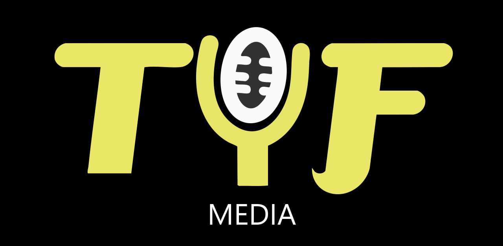

# ⚡ TYF Media — Staff Recruitment Platform

<p align="center">
  
</p>

<p align="center">
  Интерактивная веб-платформа для набора и анкетирования кандидатов в медиакоманду <b>TYF Media</b>.
</p>

<p align="center">
  
  
  
  
</p>

---

## 📌 О проекте

Веб-приложение разработано для автоматизации процесса отбора кандидатов на ключевые направления:
- 📹 **Оператор** — съемка мероприятий и студийных форматов.
- 🎬 **Монтажер** — создание динамичных роликов, подкастов и рилсов.
- 🎨 **Дизайнер** — разработка айдентики, афиш, обложек и постов.
- 🎙 **Ведущий** — работа в кадре, интервью и репортажи.
- 🎪 **Ивент** — организация медиаактивностей и координация событий.
- 📸 **Фотограф** — репортажная и студийная съемка.

---

## 🚀 Функционал

- **Интерфейс и дизайн:**
  - Глубокая темная тема (`#000000`) с акцентным цветом `#eae667`.
  - Плавная мобильная адаптивность (`clamp()`, защита от зума на iOS).
  - Динамическая загрузка направлений и тестовых заданий через URL-параметры (`?role=...`).
- **Бэкенд на Google Apps Script:**
  - Асинхронный приём заявок (`POST JSON`).
  - Автоматическая маршрутизация кандидатов: данные сразу распределяются по отдельным вкладкам соответствующих должностей.
  - Генерация кликабельных ссылок на Telegram-профили кандидатов (`=HYPERLINK(...)`).
  - Фирменная шапка таблиц и стилизация статусов с автоматической цветовой дифференциацией:
    - ⚪ **Новая** (серый)
    - 🟡 **На созвон** (желтый)
    - 🟢 **Принят** (зеленый)
    - 🔴 **Отказ** (красный)

---

## 📂 Структура проекта

```text
├── index.html       # Главный стартовый экран
├── roles.html       # Экран выбора направления
├── form.html        # Динамическая форма анкеты и тестового задания
├── logo.jpg         # Официальный логотип TYF Media
├── Code.gs          # Скрипт бэкенда для Google Apps Script
└── README.md        # Документация проекта